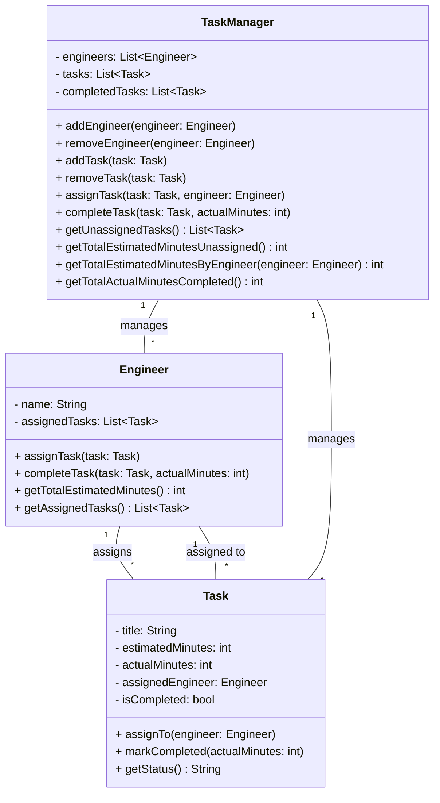

# UML Class Diagrams: Entity Classes

```mermaid
classDiagram
    class Engineer {
        - name: String
        - assignedTasks: List~Task~
        + assignTask(task: Task)
        + completeTask(task: Task, actualMinutes: int)
        + getTotalEstimatedMinutes() int
        + getAssignedTasks() List~Task~
    }

    class Task {
        - title: String
        - estimatedMinutes: int
        - actualMinutes: int
        - assignedEngineer: Engineer
        - isCompleted: bool
        + assignTo(engineer: Engineer)
        + markCompleted(actualMinutes: int)
        + getStatus() String
    }

    class TaskManager {
        - engineers: List~Engineer~
        - tasks: List~Task~
        - completedTasks: List~Task~
        + addEngineer(engineer: Engineer)
        + removeEngineer(engineer: Engineer)
        + addTask(task: Task)
        + removeTask(task: Task)
        + assignTask(task: Task, engineer: Engineer)
        + completeTask(task: Task, actualMinutes: int)
        + getUnassignedTasks() List~Task~
        + getTotalEstimatedMinutesUnassigned() int
        + getTotalEstimatedMinutesByEngineer(engineer: Engineer) int
        + getTotalActualMinutesCompleted() int
    }

    Engineer "1" -- "*" Task : assigns
    Task "*" -- "1" Engineer : assigned to
    TaskManager "1" -- "*" Engineer : manages
    TaskManager "1" -- "*" Task : manages
```
