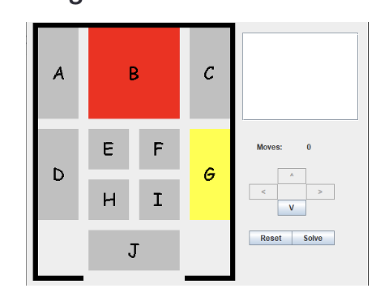
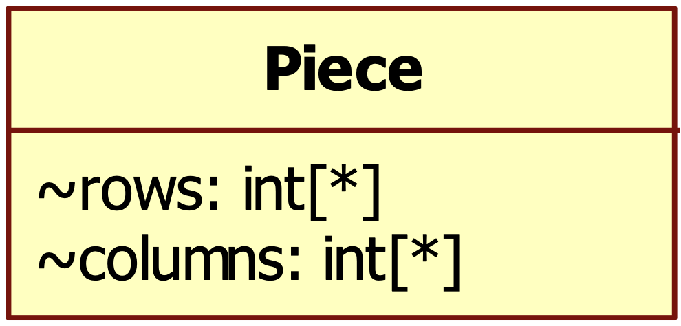
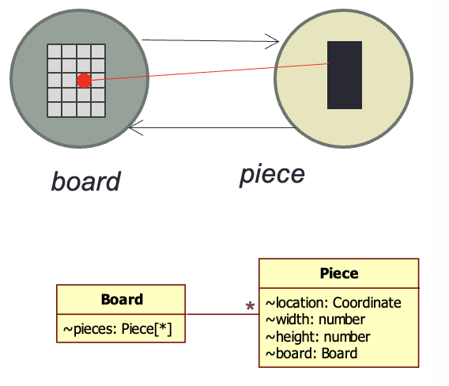
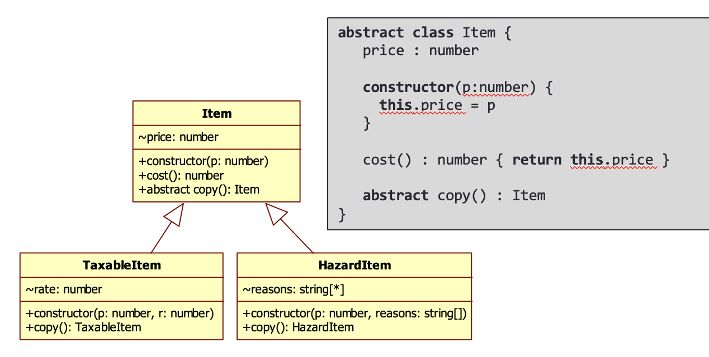
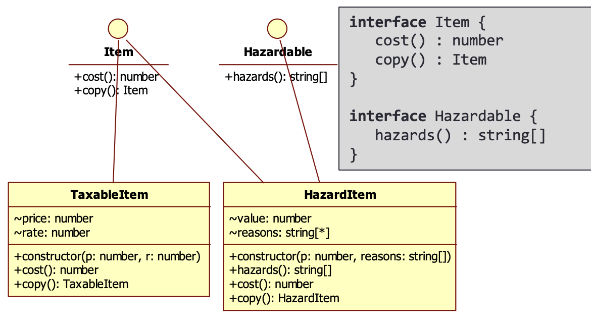

# 2 - Modeling

## Software Engineering Experiences

- Modeling Requirements
  - State       - representations of system
  - Events      - Transitions between states
  - Invariants  - Capture essential knowledge stored in model but not formally recognized in requirements
- Reminder to stop thinking about the **how** and focus on **what**
- Difficult to ignore unnecessary details
- Models must be clear and there for simple
  - "Make it as simple as possible, but no simpler"

## Object-orientated (OO) Paradigm

- Combines application and solution domain modeling
  - no longer separate activities
- start with application domain model
  - objects and relationships
- introduce solution domain model as objects
- Solution domain is transformation of Application domain
  - Often dominated by single programming language; the entire system is implemented in a single language
  - This has changed over the past decade(s) and now applications can be effortlessly made with multiple languages

## Modeling Class Diagrams

- Data Types
- Classes
- UML Notations
- JSON is a non-object-orientated way to model structured data
- Industry-standard solutions for modeling structure

### Abstract Data Type (ADT)

- Core Computer Science abstraction
  - Free programmer for knowing too many details
  - Built-in extendibility
- Each PL treats concept differently
- Expose concept but not implementation decisions
  - Though some decisions must be visible

Sliding Wood Puzzle example:


```c
typedef struct piece {
  int width;
  int height;
} PIECE;
```

```Java
class Piece {
  height : number
  width : number

}
```

### Inheritance

- The ability to extend existing types to define new types
  - In c, similar types are distinct
  - Code to process lists can be nearly identical, but you cannot share that code
- OO Modeling Improvement
  - Separate what is fixed from what varies

```c
typedef struct list {
  int         value;
  struct list *next;
} LIST_INT;

typedef struct dbl_list {
  int         value;
  struct list *next;
  struct list *prev;
} DBL_LIST_INT;
```

- Typescript does this in a unique way
  - A *structurally typed* type system

```ts
int contains (LIST_INT *list, int v) { ... }
int contains (DBL_LIST_INT *list, int v) { ... }
```

### Where to Objects come from?

- System of interacting object
  - Understand nature of composition and decomposition
  - Fewer objects mean fewer interactions
  - More objects mean larger number of interactions
- Where do objects come from?
  - A *class* is a blueprint or prototype from which objects are created
  - A *class* models the state and behavior of a real-world object
  - Analyze class in UML -> Leads to UML design -> TypeScript implementation
  - Application Domain -> Solution Domain

## How to model state

- Consider Pice in Wood Puzzle
  - Need to remember its dimensions
  - Need to remember its location
- Class defines **template** for an object's values
  - A class can define any number of attributes
  - Each attribute has a unique name (within class)
  - EAch attribute has a type
    - Primitive: `string, number, bool...`
    - Object Types: `Piece, Point, puzzle`

```ts
class Piece {
  width  : number
  height : number
}

Piece piece1 = new Piece()
piece1.width = 1
piece2.height = 2

Piece piece2 = new Piece() 
piece2.width = 2
piece2.height = 2
```

- `Piece`
  - `number[]` - array of number values `{1, 2, 3, 0}`
  - Four `number` values, width height row and column
  - Two `number` values, width height and then `Coordinate` object
  - One `Dimension` object and `Coordinate` object
  - `Coordinate[]` - array of coordinates contained by the piece
- Structure of data fundamental to success of design
  - But how do you explain your ideas to others?
  - Flexibility and Abstract Reasoning

## UML

- Unified Modeling Language
  - A collection of numerous notations pulled together to provide coverage for the kinds of modeling used in large scale programs
  - Use Case Diagrams
  - Class Diagrams
  - Sequence diagrams
- http://staruml.io is a good tool for this

### UML Class Diagrams

- Describes Structure of systems in terms of classes and objects
  - A *class* is a blueprint or prototype from which objects are created
  - A *class* models the state and behavior of a real-world object
  - An *object* is an entity that encapsulate state and is distinguishable from other objects
- Classes are always represented as an `UpperCaseWord`
  - Attributes and methods are always lower case
  - Constants (immutable data) are often capitalized

### Class Diagram Elements



- Attribute
  - `visibility AttName : TypeName [multiplicity]`
- AttName
  - Name of attribute. If <ins>underlined</ins>, then static attribute
- TypeName
  - Primitive types (number, string, ...) or Object Type (Point, ...)
- Multiplicity
  - Default is 1
  - [0..1] implies value could be `null` (Object)
  - [1..*] collection of at least one value
  - [n..m] collection with between n and m values
  - [*]    means 0 or more values.
- Visibility
  - `+` - Public
    - Other can access **word**
  - `-` - Private
    - No other object can access **word**
  - `#` - Protected
    - Objects whose class extends **Item** can access **word**
  - `~` - Package Private
    - Objects whose class extends **Item** can access **word**
    - Objects whose class exists in same package as **Item** can access **word**

## Class Relationships

- We intend to create systems of interacting objects
  - An object can interact with another object if it has a reference to that object
  - A **link** represents such a connection between two objects
- An **association** is a relationship between two classes and represents (potential) groups of links
  - Based on existing attributes
  - Associations have multiplicity and (optional) roles
  - Associations are navigable: from *Board* you can get to *Piece* but not vice versa
- Navigable Associations
  - When no arrow heads are visible, then bi-directional navigation
  - Otherwise arrowheads reflect directionality



- What does bi-directional mean
  - Each object belongs to a class
  - In each recreative class, there ios a class attribute to the other class

### Inheritance Representation



- With **inheritance**, you can create new classes built upop existing classes
  - Specify a new implementation(s) as needed
  - Gain access to existing implementation(s)

### Shared Behaviors Representation



- How to define shared behaviors that do not involve state?
- An **interface** is a type that acts as an abstraction of a class

## SOLID Principles

- Single Responsibility
  - Each class should have "one primary concern"
- Open-Closed Principle
  - It should be possible to extend your existing class (using inheritance) without modifying the existing ones
- Liskov Substitution Principle
  - Anything you can say about a type, you can say about a derived type
- Interface Segregation Principle
  - A client should not be forced to implement an interface it won't use
- Dependency Inversion Principle
  - High-level modules must depend on abstractions (interfaces or abstract base classes) not concrete classes

## Inheritance vs. Delegation

- Inheritance (IS A)
  - Define new classes by extending existing ones
  - Shared state/behavior defined by superclass
  - Specialized logic encapsulation in subclass
  - Don't seek out just for the sake of using
  - Changing relationship requires recompilation
- Delegation (HAS A)
  - Changing relationship can be done at run-rime
  - Compartmentalize information accurately
  - Peer-based relationship
