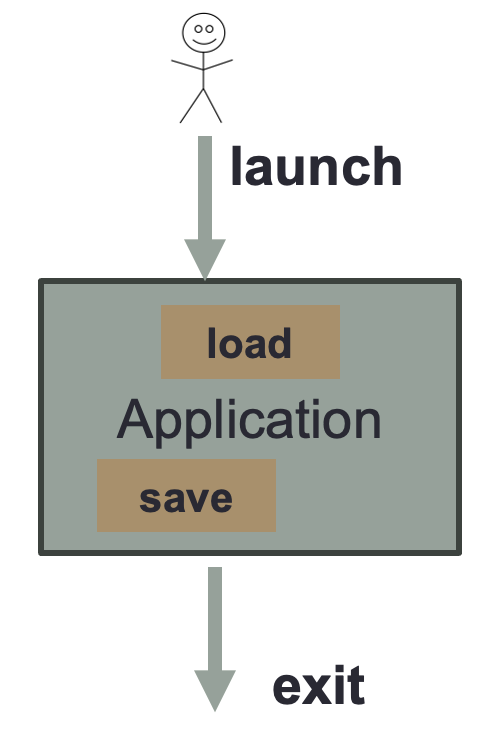
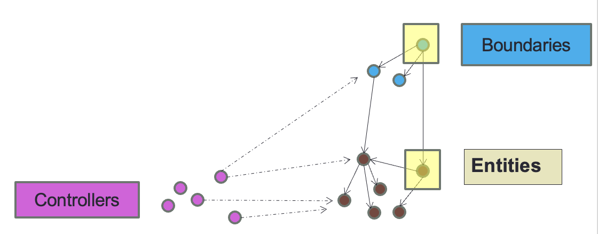
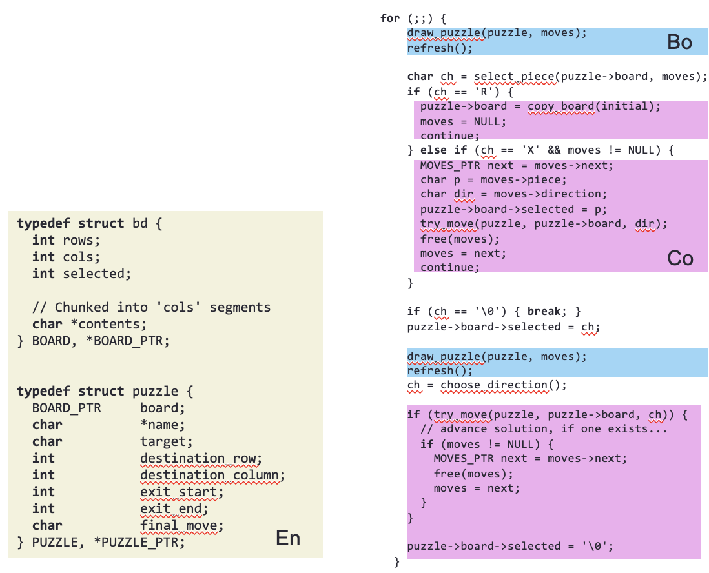

# Entity-Boundary-Controller

- Essence of high-level system organization
- Helpful for understanding distributed or decentralized software systems

## Overview

- System composed of interacting objects
  - Not focused on OO programming, but the concepts
- Common Categorization
  - **Boundary** Objects
    - Represent interactions between actors and the system
  - **Entity** Objects
    - Represent persistent information tracked by the system
  - **Control** Objects
    - Realize use cases

## Boundary

Depends upon the desired human-computer interface:

- Command-line driven
  - Like sequence of Unix commands
- Keyboard driven
  - Execute a program in terminal and all inputs is via keyboard
- GUI application
  - Mouse clicks and keyboard
  - Multiple windows with event-driven interactions
- Browser-based application
  - Single window fo multiple internal components

Every applications has multiple phases

- **launch**    - Start the application
- **load**      - load state of application (could be under user control)
- **save**      - save state of application (could be under user control, by task, or at exit time)
- **exit**      - exit application

These phases differ based on the interface

- Command-line driven
  - Each application is a single task that **loads** and **saves**
- Keyboard driven
  - Clunky interface with keypress prompts
- GUI application
  - Multiple tasks possible after **launch**
- Browser-based application
  - Applications might never **exit**

## Entity Objects

Essential concepts that must be fully understood because no solution can omit them

- Forms the core of the application domain
- Represent persistent information tracked by the system
- Key concepts from the **use cases**

## Global Topology

- Consider design in terms of objects
  - Primary model **Element** object as top-level
  - Primary app GUI element
- Navigation is key
  - From top-level element you find other information via directional links between objects
  - Avoid special knowledge of global variables (aside from primary **Element** object)
  - From top-level app you find other GUI objects to manipulate

## Controllers

- Encapsulate and separate business logic from state and presentation
