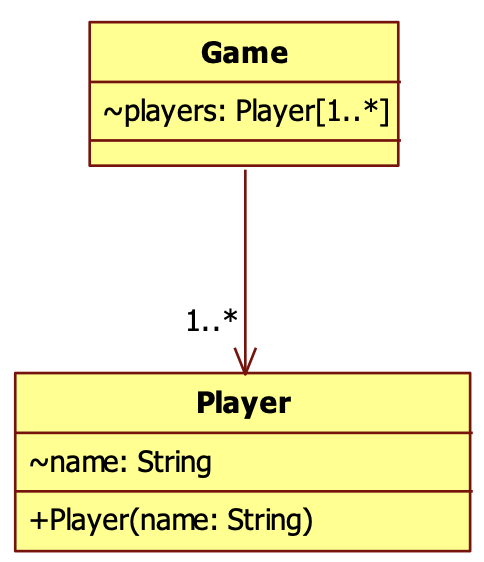
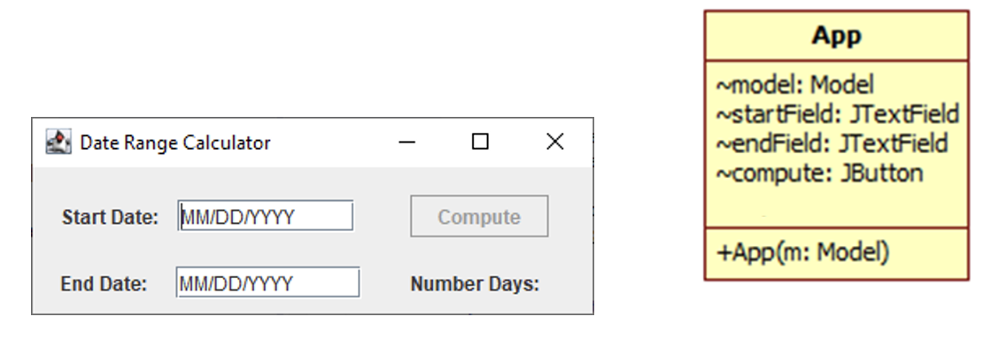

# OO Analysis

## Aggregation Relationship

Common collection relationship is 1 .. *


- Signifies Peer Relationship - neither one is more significant
- Leads to gaps of understanding

Qualified Association

- Reduces multiplicity using "keys"
- Ensures that "same student does not appear twice in course"
- Shorthand for ensuring uniqueness within collection based upon marked attribute (id in this case)

Utility


- Captures key-based semantics
- Common in <Name, Value> lookups for databases

### Aggregation


- Denotes hierarchal relationship
- Implied "1" over the white-diamond
- "Is there an operation that i would like to preform over all elements in the collection?"

### Composition


- When an object cannot exist without a container object
- Consider `Polygon/PolygoneLine` example
- No purpose in having `PolygonLine` object without enclosing `Polygon`
  - Optional (though useful) for `PolygonLine` to reference its "parent"

## How to Analyze

- Identify responsibilities of a class
  - Store information? Define attributes
  - Provide functionality? DEfine methods
  - Does it do too much? Consider splitting into multiple classes
  - S
- Sanity check each method
  - Does the class have *enough information* to meet its functional obligation?
  - If not, then you are missing attribute sand relationships

### Defining methods for classes



- Constructors
  - How to construct the objects
  - Pay attention to class relationships
- Ex: How are players added to and removed from `Game` objects?
  - 

### Methods Describe Behaviors

- Common Idioms
  - Collections / Sets / Bags that support dynamic **add** and **remove**
- Set/Get methods
  - Do not include these ever on the OOAD
  - They will be assumed, and just clutter up space otherwise
- Methods provide functionality
  - Look to use cases for inspiration
- Constructors identify information known when construction object initially
  - Not every attribute in the class belongs as a parameter to the constructor

### Methods realize purpose of class

- Each class has certain responsibilities
- Data/structural responsibilities
  - a `Model` stores the `Puzzle` which stores `Pieces` which have information
  - Navigation lets you locate the information you want
- At this early stage you can still identify capabilities that must exist. Consider `Puzzle`:
  - Need to know if a specific coordinate in puzzle is covered or not
    - `isCovered(coord: Coordinate): boolean`
  - Since it knows the selected piece, it can return a collection of potential moves (up, down, left or right)
    - `availableModes(): MoveType[*]`

## Subsystem structure


- Boundary objects (grey square)
  - Forms identified during Use Case Analysis
- Controller objects (yellow rectangle)
  - Manage use cases
  - Initiated by actions on the boundary objects
- Entity objects (green circle)
  - Track persistent information
  - NOT persistent objects
- Important subsystems will occasionally be manager objects
  - These define an interface for the system to use

### Design Goals

- Qualities that will be present
  - "Entity objects are not responsible fo their own persistent storage"
- Then must explain HOW info must persist
  - "Controllers responsible for requesting persistent changes"
- Note to shift away from WHAT to HOW

### Requirements

- Functional Requirement
  - An area of functionality the system must support
  - Independent of the realization of the system
- Non-Functional **Requirement**
  - A user-visible **constraint** on the system
  - Evaluation criteria for final system
  
## Entity Boundary Controller


- Design paradigm shows the macro structure of code
  - Demonstrates EBC structure
  - Review boundary cases for 'actionable elements'
  - Review structure of entity classes (mainly `Model`)
- Communication between objects
  - Top-level boundary objects ("the app")
  - Top-level entity object ("the model")
- Treat controllers as objects
  - Since they are stateless, they may ultimately become true functions

### Controller Structure


- Name (derived from use case)
- Attributes
  - Boundary over which it coordinates activities
  - Entity needed for its processing (might just be top-level model)
- Entry point
  - Compute method

### Controller object Example

- React based example
  - Local fcn within `<Home/>` element
  - Delegate out to stand-alone function

```ts
export function selectPiece(model, canvas, event) {
   …
}

const handleClick = (e) => {
    selectPiece(model, canvasRef.current, e);
    setRedraw(redraw+1);  // react to changes, if model has changed.
  }

<canvas ref={canvasRef}
        width={layout.canvas.width} height={layout.canvas.height}
        onClick={handleClick} />      
```

- Lower-level Behavior of controllers
  - Review controls
    - `handleClick`
    - `handleMove`
  - Observe micro-behaviors
    - GUI entry point and invocation of controllers

### Types of controllers

- Standard GUI controllers are called "Listeners" or "Handlers"
  - `MouseListener` (press, release, click, enter, exit)
  - `MouseMotionListener` (move, drag)
  - `ActionListener` (for buttons/menu items)
  - `AdjustmentListener` (for scrollbar)
  - `KeyListener` (for key events)
- Usage Example:
  - Identify the existence of a controller class to handle a particular use case as initiated by an actor
  - Determine what entities it manipulates and make sure controller objects can access entity objects
  - Determine what boundary it refreshes and make sure controller object can access boundary objects

## Boundary Design

- Every actionable element in a GUI needs to be available in the interface
  - For each attribute *X* in a class it is assumed there is a `getX()` method
  - Do not include `getX()` or `setX()` methods in design diagram since it just clutters diagram.



## Controller Methods


- Every controller needs an entry method
- Pay attention to the parameter types
  - Do not simply just use GUI events, like `actionPerformed` or `mousePress`
- Consider `PuzzleController` in GUI project
  - user clicks mouse on solved puzzle to randomize
  - User moves mouse to move piece
  - Doing multiple things so group into single Controller class
