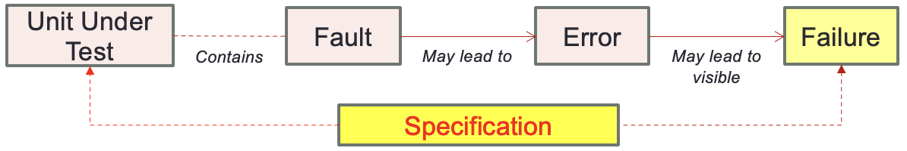
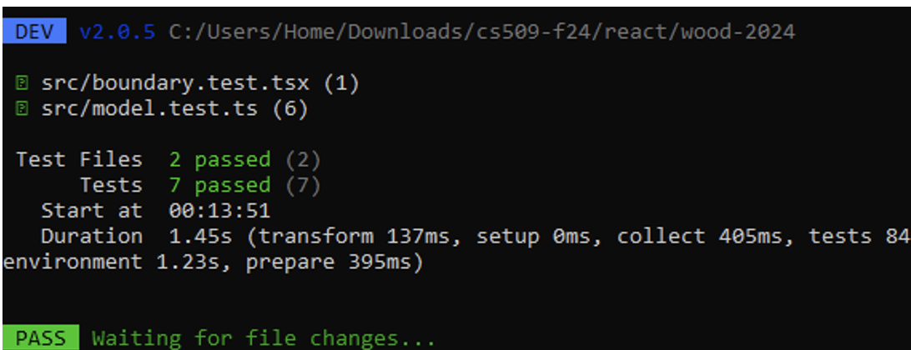
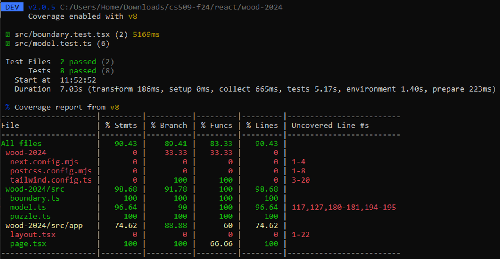

# Unit Tests

## Testing

- Systematic attempt to find faults in a planned way in the implemented software
  - You cannot use testing to prove no defects
  - Find as many as you can to reduce embarrassment
- Fault Detection
  - Code reviews
  - Inspections/WalkThroughs
  - Execution-based testing
- Quality control should happen throughout
  - While writing Use Cases
  - While modeling the Application Domain

## Testing Concepts



### Unit

- Part of the system that can be isolated for testing
- Function is the smallest unit of granularity

### Fault

- A type of defect
- Design flaw or implementation flaw that may cause abnormal unit behavior

### Error

- A type of defect
- Manifestation of a fault during execution. An error often leads to failure

### Failure

- Deviation between specification and actual behavior
- Not all errors lead to failures and some can mask each other

## Testing Process

### Test Case

- Set of input and expected results that exercises a unit
- Purpose is to cause failure and defect fault

### Test Stub

- Partial implementation of units on which tested unit depends

### Test Driver

- Partial implementations of unit that depends on the tested unit

## NPM test

- Testing approach optimized for JavaScript and React
  - uses vitest.dev for testing
  - Find test cases in `model.test.ts`
    - Any file named `*.test.ts` is assumed to contain test cases

```ts
test('Model', () => {
  let m = new Model(puzzleInformation)

  expect(m.numMoves).toBe(0)
  expect(m.victory).toBe(false)

  expect(m.puzzle.numRows).toBe(5)
  expect(m.puzzle.numColumns).toBe(4)
})

```

- There also can be setup code to execute prior to individual tests

```ts
// vitest.config.ts

export default defineConfig({
  plugins: [react()],
  test: {
    setupFiles: ['setup.ts'],
  },
})
```

```ts
// setup.ts

beforeEach(() => {
  // Do something here
})

afterEach(() => {
  // Do something here
})

```

### Testing Classes

- Entity class testing
  - Most traditional
  - Devise tests to evaluate basic capabilities
- Boundary class testing
  - Not needed - no business logic appears in the GUIs
  - Can validate content to the rendered HTML
  - The following ensures that in initial state, the browser renders with "number moves: 0" somewhere in the HTML output

```ts
test('Home', async () => {
  const { getByText } = render(<Home />)
  const movesElement = getByText(/Number of Moves: 0/i);
  
  expect(movesElement === undefined).toBe(false)
  cleanup()
})
```

### Testing logic

- Test cases can read like "scripts" of interactions

```ts
test('available', () => {
  let m = new Model(puzzleInformation)
  let p:Piece|undefined = m.puzzle.find('J')   
  m.puzzle.selected = p

  expect(m.available(Up)).toBe(false)
  expect(m.available(Down)).toBe(false)
  expect(m.available(Left)).toBe(true)
  expect(m.available(Right)).toBe(true)
})
```

### Testing Boundaries

- Can write test cases to validate any changes to externally visible HTML
  - Testing will not have access to the 'internals' since that is "under the hood logic"

```ts
test('Access GUI', async() => {
  const { getByTestId } = render(<Home />)

  const leftButton    = getByTestId('leftbutton')
  const rightButton   = getByTestId('rightbutton')
  const canvasElement = getByTestId('puzzle')
  
  expect(leftButton.disabled).toBeTruthy()
  expect(rightButton.disabled).toBeTruthy()

  fireEvent.click(canvasElement,
    { screenX: 436, screenY: 573, clientX: 184, clientY: 440 })

  expect(leftButton.disabled).toBeFalsy()
  expect(rightButton.disabled).toBeFalsy() 

  cleanup() //function to clean up test cases
})
```

### Executing Test Cases



- Launch `npm test`
  - You may have to type `npm test a` to run all tests
  - May take up to a minute for more intense, broad tests.
  - Shows test cases by descriptions once complete

## Code Coverage



- Goal is to ensure 80% code overage of `src` folder
  - This is typically a simple task if tests are written throughout development
  - Attempting to get 100% code coverage is simply a waste of resources and time
- Launch as `npm test --coverage` for this capability
  - Possibly necessary to set env variable `CI=true`

## CI/CD - Continuous integration/Deployment

- Jenkins
  - An open-source highly extensible automation sever widely for building, testing and deploying software
  - Highly customizable but significant setup and maintenance
- GitLab CI/CD
  - Integrated directly into GitLab, providing a seamless experience for projects hosts on the platform
  - Manage configuration through a `.gitlab-ci.yml` file
- GitHub Actions
  - Automate workflows directly within GitHub repositories
- Travis
  - Cloud-based CI/CD service that automates the build, test and deployment phases of software development
  - Integrates with all project hosting sides
