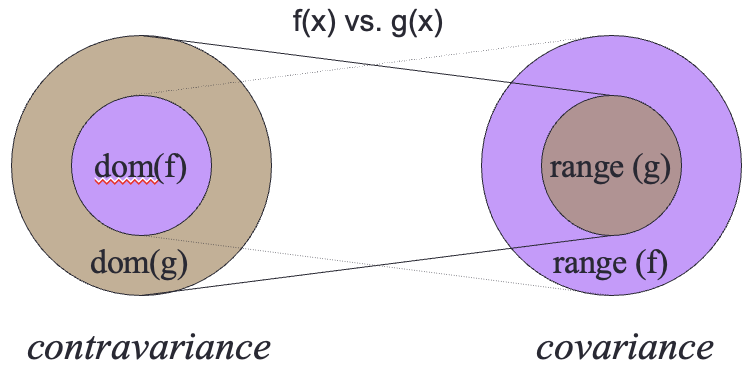

# Object Interactions

- A system is a collection of interacting objects
  - Different kinds of objects - Entity, Boundary, Controller...
  - So how do they communicate?

## Base Class

- A base class defines a useful concept in your domain (whether Application or Solution)
  - Object instantiated from classes


- Consider `java.lang.Object`
  - `equals(obj)` defaults to `this == obj`
  - `toString()` includes class name in default string
  - `hashCode()` defaults to internal integer
- These capabilities could be considered to be behaviors
  - Extending abase class closely couples the subclass to the superclass
  - Subclass inherits attributes as defined by the superclass

## Interface

- The collection of available methods to invoke
  - Rather arbitrary definition
- Before OOP, one could only restrict functions for visibility
  - Some languages offer inner functions that can't be accessed

```py
def mine():
    x = 5

    # inner function
    def t():
        return 7
    
    return x + t()

print (mine())
```

### Object Oriented Interface

- An interface is an abstract type used to specify a behavior that a class must implement
  - Deferent from an *abstract class* since it doesn't imply shared state
  - Some languages allow for *default implementations* which "blurs" the distinction a bit between classes and interfaces
    - Done to allow future changes to interfaces without breaking older clients

### Superclass vs. Interface

- Abstract Class
  - An abstract class does not allow objects to be instantiated from it
  - it supports specialization by subclasses
  - Any subclass that **extends** the class must provide implementations of all declared **abstract** methods
  - Benefit: Can still encapsulate state and data to support subclasses
- Interface
  - **Defines a subset of behavior**
  - Represented as a collection of method signature declarations
  - Any class that **implements** this interface must provide implementations of these method declarations
  - Benefit: Class can implement any number of interfaces

```TS
public interface Iterator<E> {
  boolean hasNext();
  E next();
  void remove();
}
```

## Design by Contract

- Interfaces must
  - Declare pre-condition for each method
  - Declare post-condition for each method
- Defines required service expected by client
- Defines provided service guaranteed by server

## Polymorphism

- Substitutability
- Interface pre/post conditions
  - (pre) | (post)
- Classes complement interfaces
  - May weaken pre-condition (accept more)
  - May strengthen post condition (restrict)
- Clients of interfaces
  - May strength precondition (restrict)
  - may weaken post condition (accept more)
  
### Specific Example

- Contravariance
  - Function has domain and range
- Two implementations of `log(x)` in given domain of `-1 < x < 1`

```ts

/*
 * Interface defining core functionality.
 */
public interface ICalculation {

  /*
   * Return natural log of (x+1).
   * 
   *  Precondition: 1 > x > -1
   *   
   *  Contract: Produce at least 5 digits of   
   *  precision.
   * 
   * @param x    value as a float.  
   */
  public double compute (float x);  
}
```

- Example with weaker precondition

```ts
/*
 * Compute ln (1+x).
 * 
 *   Precondition: x > -1
 * 
 * WEAKER precondition.
 */
public double compute(float x) {
  return Math.log(x+1);
}
```

- Better example

```ts
/*
 * Using Maclaurin Series, we know that
 * 
 *  ln(1+x) = x - x^2/2 + x^3/3 - x^4/4 + ...
 *  
 *   Precondition: 1 > x > -1
 */
public double compute(float x) {
  double result = x;

  double numerator = x;
  for (int term = 2; term < numTerms; term++) {
    numerator *= -x;              // alternates
    result += numerator/term;
  }

  return result;
}
```

## Contravariance & Covariance



Function G can be used safely where function f had been used if the above relationships hold

### Contravariance

- Method pre-conditions
  - Input parameters
- Provider may expect *less* than interface demands
  - boolean `equals(Object o)` in class `Something`
  - Individual implementation of `Something` can accept different objects than just `Something`
- Replace
  - Input types with more general subtypes

### Covariance

- Method post conditons
  - Output parameters and return values
- Provider may escablish *more* than interface demands

```ts
Part p = findPart(99) //return SpecialPart object
```

- Replace
  - output types with more specific subtypes
  - Supported by programming languages

## Liskov Substitution Principle

- Contravariance & Covariance
  - Apply to types
- S is a subtype of T if
  - Object of type S can be substituted in all places where T is expected
- Typing is critical
  - Only way that compiler knows code is "correcT"
- This applies to languages with only classes
- Also applies whenever there is an interface

## Law of Demeter

- Concept helps programmers reduce complexity
  - Principle of Least Knowledge
- "Inside of a method M, with what other objects can M communicate?"

```ts
public class C {
  Other other;

  //...

    public void M(Item i) {
        // Note: M can always access any globally accessible object within the scope of M.
        Special s = new Special(...);
        Exotic e = s.doSomething();
    }

}
```

1. Methods in C (“this”)
2. Attributes in C (“other”)
3. M’s parameters (“i”)
4. Objects instantiated in M (“s”)

Seek to avoid sequences of “.”
> `s.doSomething().another().last()`
